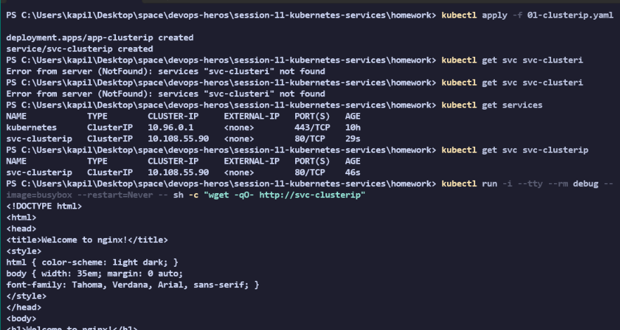
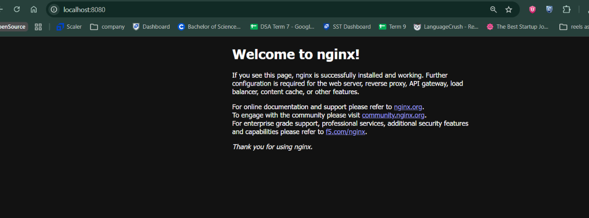
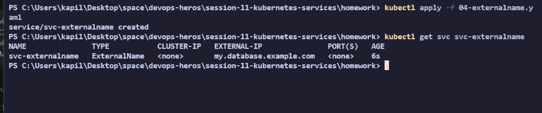

# Session 11: Kubernetes Networking & Services Homework
# CoreDNS in Kubernetes

## What is CoreDNS?
CoreDNS is a flexible, extensible DNS server that serves as the default cluster DNS for Kubernetes. It is deployed as a set of Pods running inside the `kube-system` namespace.

## Why Kubernetes uses CoreDNS
Kubernetes needs a way for services to discover each other dynamically because Pod IPs are ephemeral (they change constantly). CoreDNS solves this by automatically maintaining a registry of DNS records that map predictable Service names to their current IPs.

## How Service Discovery Works
1. A Service is created.
2. Kubernetes API informs CoreDNS.
3. CoreDNS creates a DNS record (`A` record for the IP, `SRV` for ports).
4. Any Pod can now resolve the Service name to its IP.

## How DNS Queries are Resolved
1. A Pod makes a network request (e.g., `curl http://backend-svc`).
2. The Pod's `/etc/resolv.conf` directs the DNS query to the CoreDNS service IP.
3. CoreDNS checks its records. If it's an internal Kubernetes name, it returns the ClusterIP. If it's an external name (like `google.com`), CoreDNS forwards the query to the upstream DNS server.

## CoreDNS Configuration
CoreDNS is configured via a Kubernetes ConfigMap named `coredns` in the `kube-system` namespace. The configuration file inside the ConfigMap is called the `Corefile`. It defines plugins (like `kubernetes`, `forward`, `errors`, `health`) that dictate how DNS requests are handled.

## How to Troubleshoot DNS Issues
1. **Check if CoreDNS pods are running:**
   `kubectl get pods -n kube-system -l k8s-app=kube-dns`
2. **Test DNS from a utility pod:**
   `kubectl run -it --rm debug --image=busybox -- nslookup kubernetes.default`
3. **Check CoreDNS logs:**
   `kubectl logs -n kube-system -l k8s-app=kube-dns`
4. **Verify the Pod's `/etc/resolv.conf`:** Ensure it points to the CoreDNS IP.

## Task 1: Kubernetes Services

### 1. ClusterIP
**Apply & Test:**
```bash
kubectl apply -f 01-clusterip.yaml
kubectl get svc svc-clusterip
# To test connectivity, use a temporary busybox pod to curl the service
kubectl run -i --tty --rm debug --image=busybox --restart=Never -- sh -c "wget -qO- http://svc-clusterip"
```


### 2. NodePort
**Apply & Test:**
```bash
kubectl apply -f 02-nodeport.yaml
kubectl get svc svc-nodeport
kubectl port-forward service/svc-nodeport 8080:80

```


### 3. LoadBalancer
**Apply & Test:**
```bash
kubectl apply -f 03-loadbalancer.yaml
kubectl get svc svc-lb

```


### 4. ExternalName
**Apply & Test:**
```bash
kubectl apply -f 04-externalname.yaml
kubectl get svc svc-externalname
```


### 5. Headless Service
**Apply & Test:**
```bash
kubectl apply -f 05-headless.yaml
kubectl get svc svc-headless

kubectl run -i --tty --rm debug --image=busybox --restart=Never -- nslookup svc-headless
```

---

## Task 2: Kubernetes Object Comparison

### 1. Deployment vs ReplicaSet
*   **Purpose:** A **ReplicaSet** ensures a specified number of pod replicas are running at any given time. A **Deployment** is a higher-level concept that manages ReplicaSets and provides declarative updates to Pods.
*   **Pod Management:** ReplicaSet directly manages pods. Deployment manages ReplicaSets.
*   **Scaling:** Both can be scaled up or down.
*   **Rolling Updates:** ReplicaSets **do not** support rolling updates. Deployments **do** support rolling updates (and rollbacks) seamlessly.
*   **Relationship:** A Deployment creates a ReplicaSet to bring up the pods. When you update a Deployment, it creates a *new* ReplicaSet, scales it up, and scales the *old* ReplicaSet down.

### 2. Deployment vs DaemonSet vs StatefulSet
*   **Deployment:** Best for stateless applications (e.g., web servers). Pods are interchangeable and can run on any node. Uses standard scaling and rolling updates.
*   **DaemonSet:** Ensures that exactly *one* copy of a Pod runs on *every* node (or specific nodes) in the cluster. **Use Case:** Logging agents (Fluentd), monitoring agents (Prometheus Node Exporter), or networking plugins (Calico).
*   **StatefulSet:** Best for stateful applications (e.g., Databases like MySQL, MongoDB). Pods are created with a sticky, predictable identity (e.g., `db-0`, `db-1`) and ordered, graceful deployment and scaling. It guarantees stable network IDs and stable persistent storage.

### 3. ReplicaSet vs Service
*   **ReplicaSet Responsibility:** Ensures the desired number of Pods are running. It handles application availability and scaling.
*   **Service Responsibility:** Provides a stable IP address and DNS name to a set of Pods. It acts as an internal load balancer.
*   **Why a Service is required:** Pods are ephemeral; their IP addresses change every time they are restarted or recreated by a ReplicaSet. A Service gives you a fixed IP to talk to, regardless of how many Pods die and respawn behind it.
*   **How traffic reaches Pods:** Traffic hits the Service's IP, and the Service uses `iptables`/`IPVS` rules to forward the request to the IP of one of the healthy Pods matching its `selector`.
