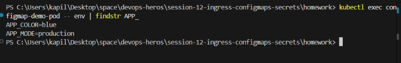
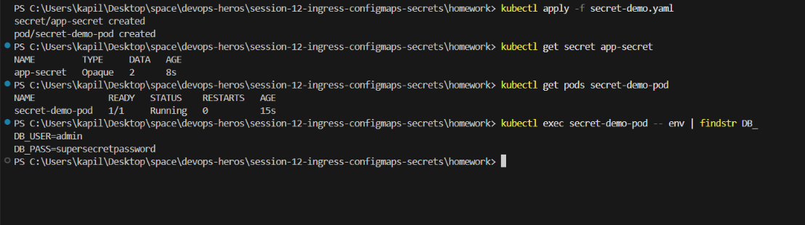

# Session 12: Kubernetes Ingress, ConfigMaps & Secrets

## Task 1: ConfigMap Demo
Run the following commands to create the ConfigMap and verify its values inside the Pod:

```bash
kubectl apply -f configmap-demo.yaml
kubectl get configmap app-config
kubectl get pods configmap-demo-pod
# Once the pod is running, verify the env variables:
kubectl exec configmap-demo-pod -- env | findstr APP_
```



## Task 2: Secret Demo
Run the following commands to create the Secret and verify its values inside the Pod:

```bash
kubectl apply -f secret-demo.yaml
kubectl get secret app-secret
kubectl get pods secret-demo-pod
# Once the pod is running, verify the env variables:
kubectl exec secret-demo-pod -- env | findstr DB_
```


### Why Secrets should not be committed directly to Git?
Secrets in Kubernetes are only Base64 encoded, not encrypted. If you commit them to a Git repository in plain text or Base64 format, anyone with read access to the repository can easily decode and access sensitive information like passwords, API keys, or tokens. They should be managed via external secret managers (like HashiCorp Vault, AWS Secrets Manager) or encrypted using tools like Sealed Secrets or SOPS before committing.


## Task 3: Ingress Demo
Run the following commands to deploy the app, service, and Ingress:

```bash
kubectl apply -f ingress-demo.yaml
kubectl get ingress web-app-ingress
# Test the routing (assuming an Ingress controller like nginx is running and mapping webapp.local)
curl.exe -H "Host: webapp.local" http://localhost
```
## Task 4: Ingress vs Ingress Controller

### What is Ingress?
Ingress is a Kubernetes API object that manages external access to the services in a cluster, typically HTTP and HTTPS. It acts as a set of routing rules (e.g., path-based or host-based routing) for incoming traffic.

### What is an Ingress Controller?
An Ingress Controller is a specialized load balancer (like NGINX, Traefik, or HAProxy) running inside the Kubernetes cluster. It reads the Ingress objects' rules and actually implements the routing by configuring the underlying load balancer.

### Difference between them
- **Ingress** is just the configuration or set of rules (the "What").
- **Ingress Controller** is the actual application/daemon that reads those rules and routes traffic accordingly (the "How").

### Why both are required
Without an Ingress Controller, creating an Ingress resource will have no effect. The Ingress object simply stores the routing rules, and you need an actively running Ingress Controller to watch for these rules, parse them, and process the traffic based on them.

### Examples
- **Ingress Controller:** NGINX Ingress Controller, Traefik, HAProxy Ingress, AWS ALB Ingress Controller.
- **Ingress:** A YAML file defining that `http://myapp.com/api` should route traffic to the `api-service` and `http://myapp.com/web` should route traffic to the `web-service`.

## Task 5: Troubleshooting

### Problem Identified
The database pod rejects application connections with an authentication failure (`FATAL: password authentication failed`). The developer created the secret using `echo "mypassword" | base64`.

### Troubleshooting Commands Run
```bash
echo "mypassword" | xxd
echo "mypassword" | base64
```

### Root Cause
The standard `echo` command appends a newline character (`\n`) at the end of the string. When this string is Base64 encoded, the newline is included as part of the password payload (base64 ends in `Ao=`). The application sends a password of 11 characters (`mypassword\n`) instead of 10 (`mypassword`), which the database rejects.

### The Fix
Use the `-n` flag with `echo` to suppress the trailing newline before encoding:
```bash
echo -n "mypassword" | base64
```
*(Notice how the Base64 string now ends in `==` instead of `Ao=`)*

### Before Output
```bash
$ echo "mypassword" | base64
bXlwYXNzd29yZAo=
```

### After Output
```bash
$ echo -n "mypassword" | base64
bXlwYXNzd29yZA==
```