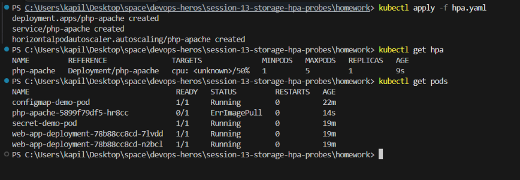
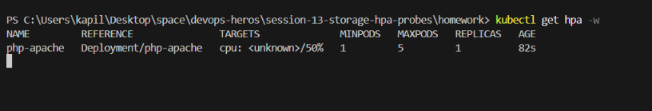
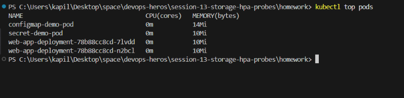
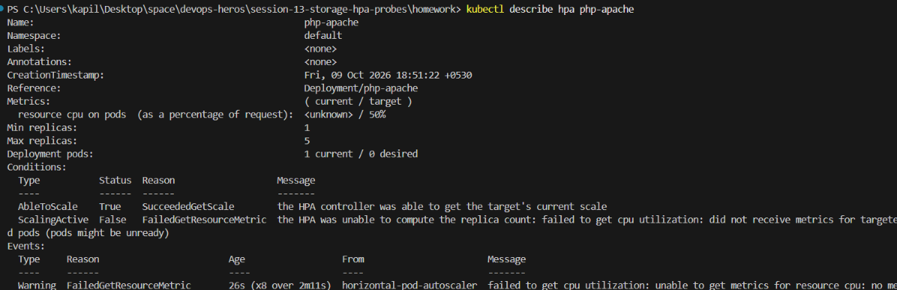
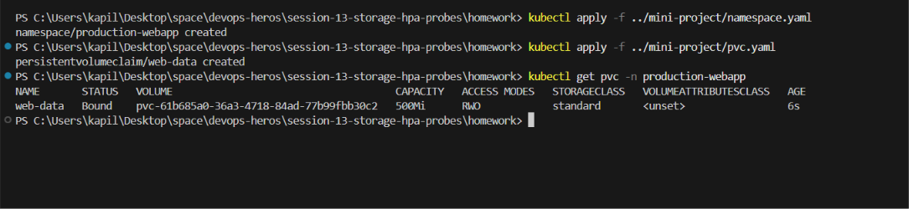
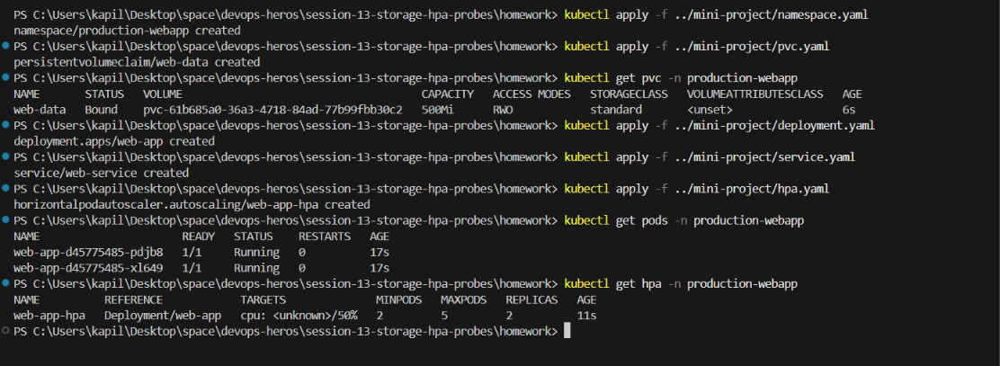
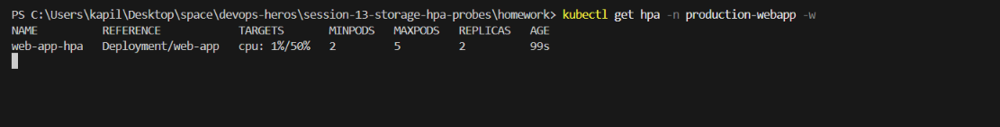

# Session 13: Kubernetes Storage, HPA & Probes

## Task 1: Volume Documentation
The documentation for Kubernetes Volumes (emptyDir, hostPath, PersistentVolume, PersistentVolumeClaim, StorageClass, and Dynamic provisioning) is available in [01-kubernetes-volumes-README.md](01-kubernetes-volumes-README.md).

## Task 2: HPA Hands-on

Run the following commands to test the Horizontal Pod Autoscaler. 
*Note: Make sure your `metrics-server` is running.*

### 1. Deploy the Application and HPA
```bash
kubectl apply -f hpa.yaml
kubectl get pods
kubectl get hpa
```


### 2. Deploy a Load Generator
Run a busybox pod in a loop to generate HTTP requests:
```bash
kubectl run -i --tty load-generator --rm --image=busybox:1.28 --restart=Never -- /bin/sh -c "while sleep 0.01; do wget -q -O- http://php-apache; done"
```


### 3. Observe CPU Utilization and Pod Scaling
Open a new terminal window and monitor the HPA and Pods:
```bash
# Watch the HPA scale up (it may take 1-3 minutes)
kubectl get hpa -w
```


```bash
# See the CPU usage of the pods
kubectl top pods
```


```bash
# Check the autoscaler events
kubectl describe hpa php-apache
```

Once done, stop the load generator (Ctrl+C).

---

## Task 3: Mini Project Implementation

The mini project demonstrates a production-ready application using Persistence, HPA, and Probes. We will use the existing files in the `../mini-project/` folder.

### 1. Setup Namespace and Storage
```bash
kubectl apply -f ../mini-project/namespace.yaml
kubectl apply -f ../mini-project/pvc.yaml
kubectl get pvc -n production-webapp
```


### 2. Deploy Application, Service, and HPA
```bash
kubectl apply -f ../mini-project/deployment.yaml
kubectl apply -f ../mini-project/service.yaml
kubectl apply -f ../mini-project/hpa.yaml
kubectl get pods -n production-webapp
kubectl get hpa -n production-webapp
```


### 3. Verify Persistence (Write Data & Kill Pod)
```bash
POD_NAME=$(kubectl get pods -n production-webapp -l app=web-app -o jsonpath='{.items[0].metadata.name}')
kubectl exec -n production-webapp "$POD_NAME" -- sh -c 'echo "My Name" > /data/student.txt'
kubectl exec -n production-webapp "$POD_NAME" -- cat /data/student.txt

# Delete the pod to verify persistence
kubectl delete pod -n production-webapp "$POD_NAME"
```

Wait for the new pod to start, then verify data remains:
```bash
NEW_POD=$(kubectl get pods -n production-webapp -l app=web-app -o jsonpath='{.items[0].metadata.name}')
kubectl exec -n production-webapp "$NEW_POD" -- cat /data/student.txt
```

### 4. Trigger HPA Scaling on Mini Project
Launch the load generator for the mini project:
```bash
kubectl run load-generator -n production-webapp --image=busybox:1.36 --restart=Never -- /bin/sh -c "while true; do wget -q -O- http://web-service; done"
```

Watch it scale out:
```bash
kubectl get hpa -n production-webapp -w
```


