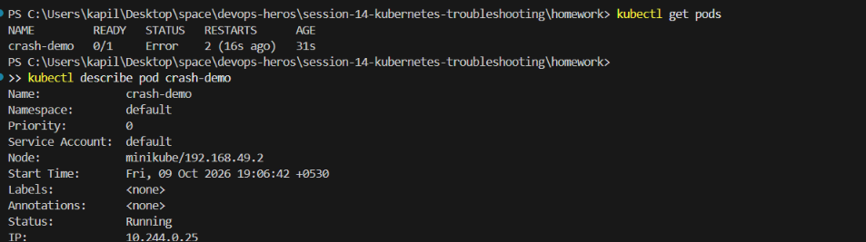
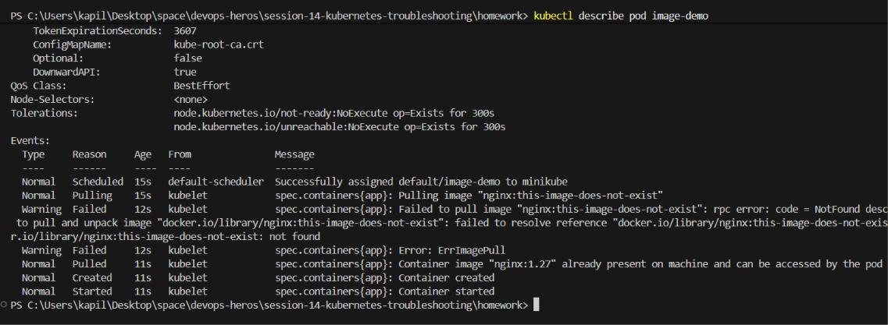
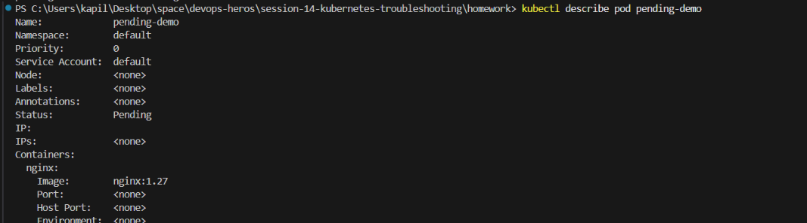

# Session 14: Kubernetes Troubleshooting

## Task 1: Kubernetes Commands
Here are the essential troubleshooting commands you should practice:
- `kubectl get pods` / `kubectl get pods -o wide`
- `kubectl describe pod <pod_name>`
- `kubectl logs <pod_name>`
- `kubectl exec -it <pod_name> -- /bin/sh`
- `kubectl get events --sort-by='.metadata.creationTimestamp'`
- `kubectl explain pods.spec`
- `kubectl top pods`


## Task 2: Troubleshoot Common Issues
For each common issue, we will deploy a broken YAML file, investigate it, find the root cause, and document the fix.

### 1. CrashLoopBackOff
```bash
kubectl apply -f ../06-crashloopbackoff/
# Investigate
kubectl get pods
kubectl logs <pod-name>
kubectl describe pod <pod-name>
```
**Problem:** The Pod keeps crashing and restarting.
**Investigation:** Used `kubectl logs` to see the application output before it crashed.
**Root Cause:** Usually caused by a misconfigured command, missing environment variables, or a fatal application error on startup.
**Solution:** Fix the command or environment variables in the YAML file and reapply.


### 2. ImagePullBackOff / ErrImagePull
```bash
kubectl apply -f ../07-imagepullbackoff/
# Investigate
kubectl get pods
kubectl describe pod <pod-name>
```
**Problem:** The Pod cannot start because it cannot pull the container image.
**Investigation:** Used `kubectl describe` to check the Events section at the bottom.
**Root Cause:** Typo in the image name, invalid tag, or missing image pull secrets for a private registry.
**Solution:** Correct the `image` field in the YAML file.



### 3. Pending
```bash
kubectl apply -f ../08-pending-pods/
# Investigate
kubectl get pods
kubectl describe pod <pod-name>
```
**Problem:** The Pod stays in a `Pending` state indefinitely.
**Investigation:** Used `kubectl describe` to check the Scheduler events.
**Root Cause:** The cluster lacks sufficient resources (CPU/Memory) to schedule the Pod, or there is an unsatisfiable `nodeSelector`/taint.
**Solution:** Lower the resource `requests` or fix the node affinity rules.


### 4. Service / DNS / Networking Issues
```bash
kubectl apply -f ../09-service-dns-troubleshooting/
# Investigate
kubectl get svc
kubectl describe svc <svc-name>
kubectl get endpoints <svc-name>
```
**Problem:** The service is unreachable or DNS resolution is failing.
**Investigation:** Checked `kubectl get endpoints` to see if the Service successfully matched the Pods.
**Root Cause:** Usually a mismatch between the Service's `selector` and the Pod's `labels`, or the Pod is failing its readiness probe.
**Solution:** Align the selector labels with the Pod labels and ensure the Pod is `Ready`.


## Task 3: Mini Project
Navigate to the mini project folder and apply the broken resources:
```bash
kubectl apply -f ../mini-project/
# Investigate the resources
kubectl get all -n troubleshooting-ns
kubectl describe pods -n troubleshooting-ns
```


