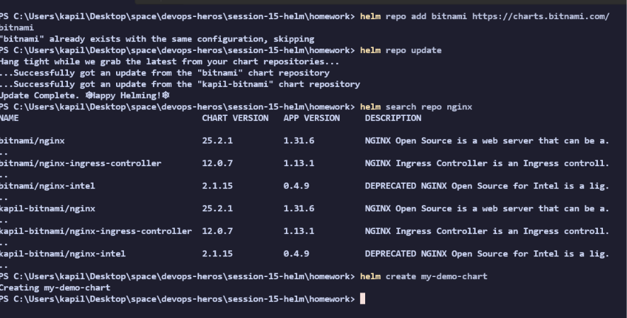
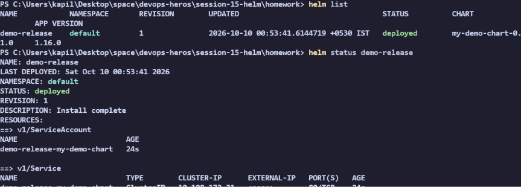
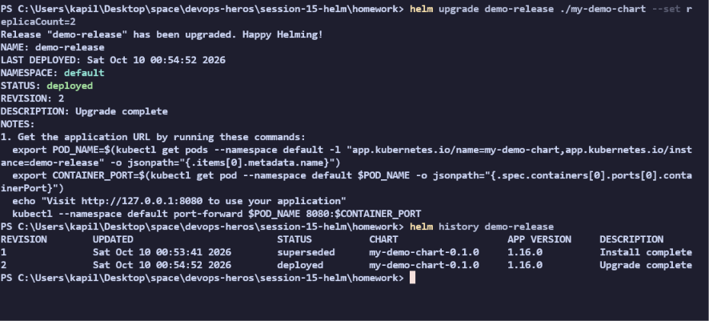
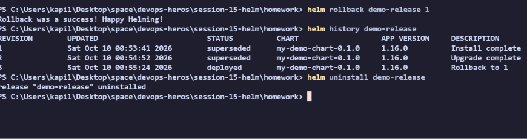
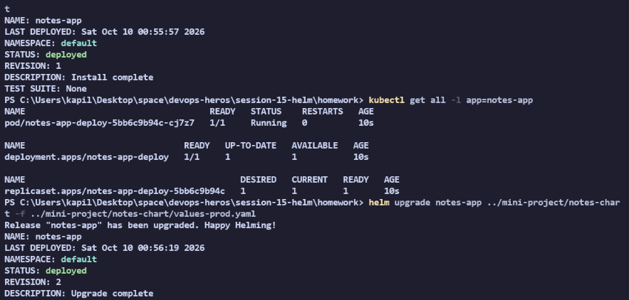

# Session 15: Helm

## Task 1: Helm Commands Practice
Run the following commands to get hands-on experience with Helm:

```bash
# 1. Add a Helm repo and search for a chart
helm repo add bitnami https://charts.bitnami.com/bitnami
helm repo update
helm search repo nginx

# 2. Create your own Helm chart template
helm create my-demo-chart

# 3. Install the chart
helm install demo-release ./my-demo-chart

# 4. List releases and view status
helm list
helm status demo-release

# 5. Get all the generated resources
helm get all demo-release
```



## Task 2: Helm Rollback Workflow
Perform the upgrade and rollback workflow using the chart you just created:

```bash
# 1. Verify current version
helm list

# 2. Upgrade the release (e.g., changing the replica count)
helm upgrade demo-release ./my-demo-chart --set replicaCount=2

# 3. Verify the upgrade
helm history demo-release
kubectl get pods -l app.kubernetes.io/instance=demo-release

# 4. Rollback to the previous version
helm rollback demo-release 1

# 5. Verify the rollback
helm history demo-release
kubectl get pods -l app.kubernetes.io/instance=demo-release

# 6. Uninstall the release
helm uninstall demo-release
```



## Task 3: Mini Project
The mini project is located in the `../mini-project/` folder. It contains a custom `notes-chart`. Let's install it and perform an upgrade with a custom values file.

```bash
# 1. Install the mini-project chart
helm install notes-app ../mini-project/notes-chart

# 2. Check the deployed resources
kubectl get all -l app=notes-app

# 3. Upgrade using the production values file
helm upgrade notes-app ../mini-project/notes-chart -f ../mini-project/notes-chart/values-prod.yaml

# 4. Check the upgraded resources (e.g., replicas changed, NodePort service updated)
kubectl get all -l app=notes-app

# 5. Clean up
helm uninstall notes-app
```


