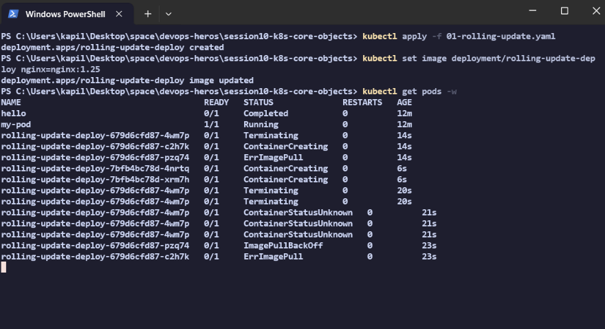
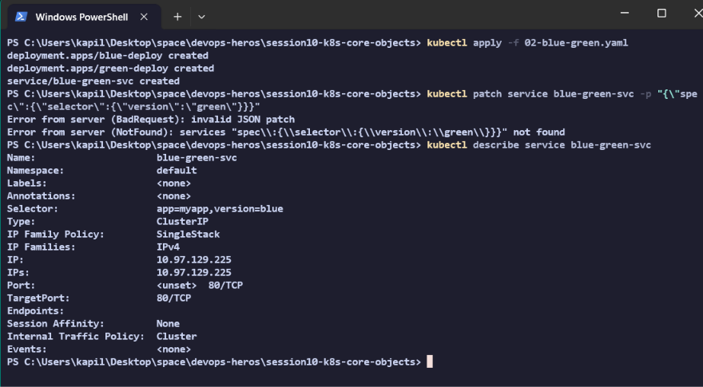
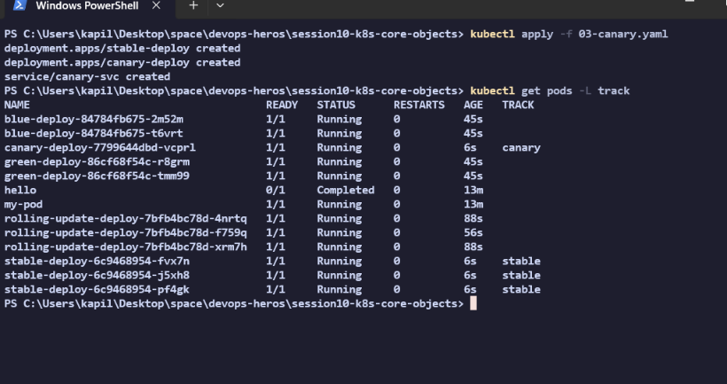
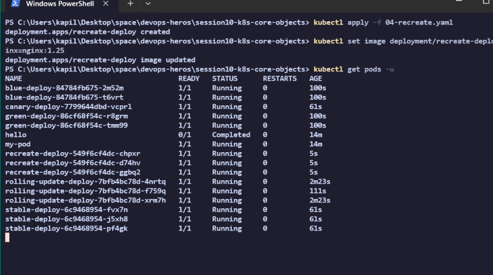
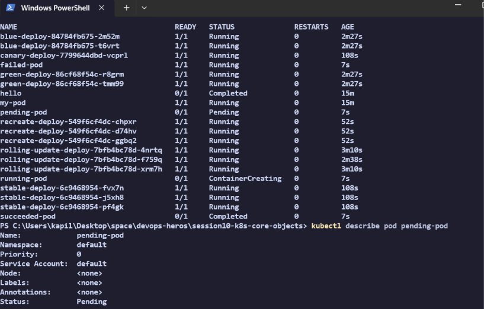

- https://github.com/Nency-Ravaliya/Kubernetes 

- k8s core objects: https://github.com/Nency-Ravaliya/Kubernetes/blob/main/core-objects.md 

---

# Session 10: Kubernetes Pods, ReplicaSets & Deployments

## Task 1: Deployment Strategies

### 01. Rolling Update
**Explanation:** Slowly replaces old Pods with new ones without downtime. This is Kubernetes' default deployment strategy.

**Commands to run for screenshots:**
```bash
# 1. Apply the initial deployment
kubectl apply -f 01-rolling-update.yaml

# 2. Update the image to trigger the rolling update
kubectl set image deployment/rolling-update-deploy nginx=nginx:1.25

# 3. Watch the old pods terminate and new ones create
kubectl get pods -w
```

---

### 02. Blue-Green Deployment
**Explanation:** Maintains two identical environments (Blue for old, Green for new). Traffic is completely switched from the old version to the new version at the Service level by updating the label selector.

**Commands to run for screenshots:**
```bash
# 1. Apply the Blue, Green, and Service configurations
kubectl apply -f 02-blue-green.yaml

# 2. Switch traffic to the green deployment by patching the service selector
kubectl patch service blue-green-svc -p "{\"spec\":{\"selector\":{\"version\":\"green\"}}}"

# 3. Verify the service is now selecting the green pods
kubectl describe service blue-green-svc
```


---

### 03. Canary Deployment
**Explanation:** Routes a small percentage of traffic to a new version (Canary) while the majority stays on the stable version. In our YAML, we use 3 replicas for stable and 1 replica for canary under the same service selector (`app: canary-app`), naturally routing ~25% of traffic to the new version.

**Commands to run for screenshots:**
```bash
# 1. Apply both stable and canary deployments + the service
kubectl apply -f 03-canary.yaml

# 2. View all pods with their labels to see the 3:1 ratio
kubectl get pods -L track
```


---

### 04. Recreate Deployment
**Explanation:** Terminates all existing old Pods completely before starting any new Pods, resulting in brief downtime but ensuring no two versions run at the same time.

**Commands to run for screenshots:**
```bash
# 1. Apply the deployment
kubectl apply -f 04-recreate.yaml

# 2. Update the image to trigger the recreate strategy
kubectl set image deployment/recreate-deploy nginx=nginx:1.25

# 3. Watch the pods: you will see all old ones terminate before any new ones spin up
kubectl get pods -w
```


---

## Task 2: Pod Lifecycle

**Explanation:** Demonstrates the 4 main states a Pod can enter during its lifecycle.
- **Pending:** The pod is accepted by the cluster but cannot be scheduled (e.g. lacks resources).
- **Running:** The pod is bound to a node and the container is actively running.
- **Succeeded (Completed):** The container ran a task that finished successfully and exited with code `0`.
- **Failed (Error):** The container ran a task that failed and exited with a non-zero code.

**Commands to run for screenshots:**
```bash
# 1. Apply all 4 pods at once
kubectl apply -f 05-pod-lifecycle.yaml

# 2. Wait a few seconds, then check their statuses
kubectl get pods

# 3. Check the details of the pending pod to see why it's stuck
kubectl describe pod pending-pod
```

