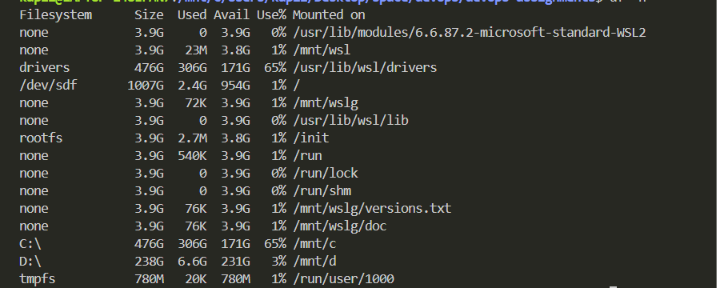
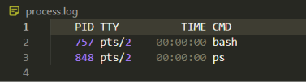

#!/bin/bash

# date

Wednesday, September 2, 2026 11:12:28 PM

# hostname

LAPTOP-14UEFAN7

# whoami

laptop-14uefan7\kapil

# df -h

# ps

    PID TTY          TIME CMD
    317 pts/0    00:00:00 bash
    475 pts/0    00:00:00 ps

# read -p "Enter directory name: " dir_name

Enter your name: kapil

# mkdir result_file

result_file

# touch result.log

create a result.log file

# ps > process.log

