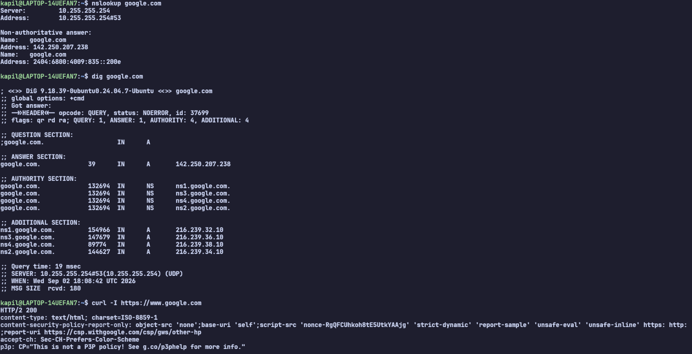
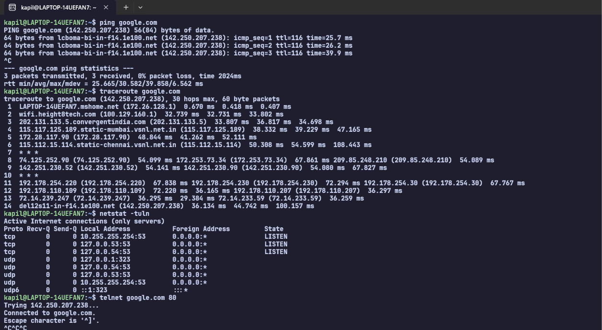

## Task 2: Networking Commands

### 1. `ping`

**What I understood:**

The `ping` command is used to check whether a device or website is reachable over a network. It sends packets to the destination and shows the response time, which helps understand network connectivity and latency.

---

### 2. `traceroute`

**What I understood:**

The `traceroute` command shows the path taken by network packets from my computer to the destination. It displays the different network hops and their response times, which helps identify where delays or connection problems may occur.

---

### 3. `netstat`

**What I understood:**

The `netstat` command displays network connections, listening ports, and network-related information. It helps identify which ports are open and which services may be using them.

---

### 4. `telnet`

**What I understood:**

The `telnet` command can be used to test whether a connection can be established to a particular host and port. In this case, port `80` is used to test HTTP connectivity to Google.

---

### 5. `tcpdump`

**What I understood:**

The `tcpdump` command captures and displays network packets traveling through a network interface. It is useful for monitoring network traffic and troubleshooting connectivity or communication problems.

---

### 6. `nslookup`

**What I understood:**

The `nslookup` command is used to query DNS and find information about a domain name. It can show the IP address associated with a domain and helps troubleshoot DNS resolution problems.

---

### 7. `dig`

**What I understood:**

The `dig` command is used to perform DNS queries and provides detailed information about the DNS response. It is useful for understanding how domain names are resolved and troubleshooting DNS issues.

---

### 8. `curl`

**What I understood:**

The `curl` command is used to communicate with web servers using protocols such as HTTP and HTTPS. Using `-I` displays only the response headers, which helps check whether a website is reachable and inspect the server's HTTP response.

---

## Conclusion

Through this task, I practiced different networking commands and learned how to check network connectivity, trace network routes, inspect ports, test specific ports, capture network packets, perform DNS queries, and test HTTP connectivity.

