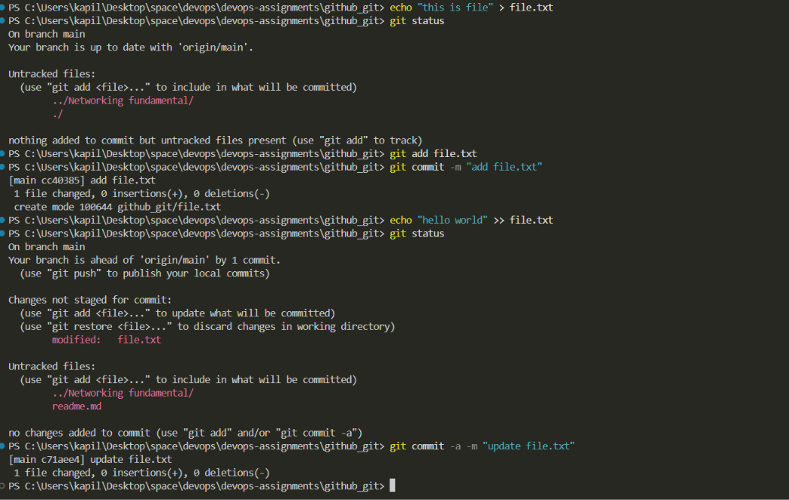
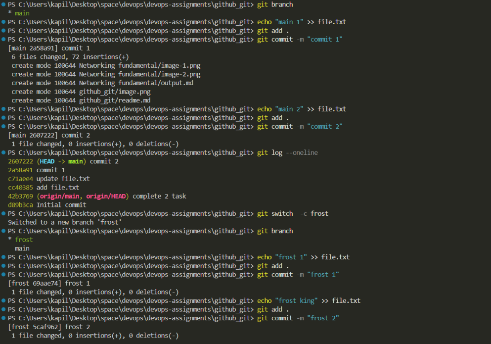
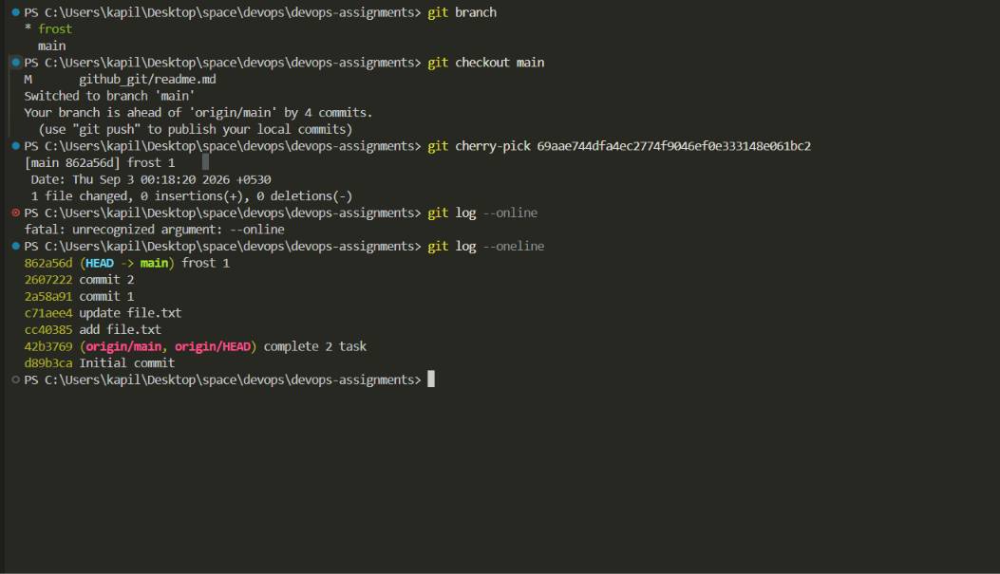

## Task 1: `git commit -a -m`

I practiced both `git commit -m` and `git commit -a -m` and observed the difference between them.

### What I understood

`git commit -m "message"` commits the files that have already been staged using `git add`.

`git commit -a -m "message"` automatically stages and commits **modified or deleted tracked files**, so `git add` is not required for those files.

However, `git commit -a -m` does not include newly created untracked files. New files must be added using `git add` first.

### Screenshots

## 

## Task 2: Git Cherry-Pick

I created multiple commits in the `main` branch and then created a separate branch with additional commits.

I used `git log --oneline` to view the commit history and identify a specific commit.

I then switched back to the `main` branch and used `git cherry-pick` with the selected commit hash.

### What I understood

`git cherry-pick` is used to apply a specific commit from another branch to the current branch.

Instead of merging the entire branch, cherry-pick allows a particular commit to be selected and applied to another branch.

In this task, I selected one commit from the new branch and successfully applied it to the `main` branch.

## Conclusion

Through this task, I learned the difference between `git commit -m` and `git commit -a -m` and practiced using `git cherry-pick` to apply a specific commit from one branch to another.
