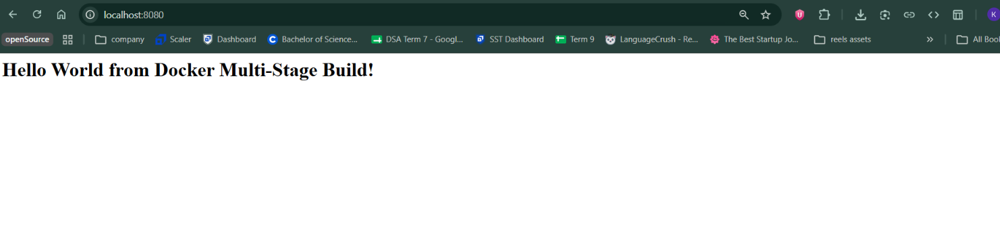
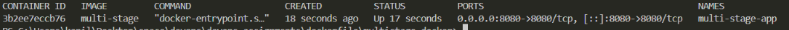

# Docker Multi-Stage Build - Submission

## Student Details

- **Name:** Kapil
- **Enrollment Number:** 24bcs10120

---

## Task 1: Multi-Stage Build

### Dockerfile

The multi-stage Dockerfile has two stages:

- **Stage 1 (builder):** Installs all dependencies (including dev) and copies source code.
- **Stage 2 (production):** Copies only production dependencies and the server file, keeping the final image lean.

```dockerfile
# Stage 1: Build
FROM node:24-alpine AS builder
WORKDIR /app
COPY package*.json ./
RUN npm install
COPY . .

# Stage 2: Production
FROM node:24-alpine AS production
WORKDIR /app
COPY --from=builder /app/package*.json ./
RUN npm install --omit=dev
COPY --from=builder /app/server.js ./
EXPOSE 8080
CMD ["npm", "start"]
```

### Commands Used

**Build the image:**

```bash
docker build -t multi-stage .
```

**Run the container:**

```bash
docker run -d -p 8080:8080 --name multi-stage-app multi-stage
```

**Verify running container:**

```bash
docker ps
```

### Application Output

Accessing `http://localhost:8080` displays:



### docker ps Output



---

## Task 2: Deployed Applications

Three different types of applications deployed using Docker:

### 1. Node.js Application

- **Folder:** `tasks/nodejs-app/`
- **Port:** 3000
- **Command:**

```bash
docker build -t nodejs-hello ./task3/nodejs-app
docker run -d -p 3000:3000 --name nodejs-hello nodejs-hello
```

### 2. Python Application

- **Folder:** `tasks/python-app/`
- **Port:** 5000
- **Command:**

```bash
docker build -t python-hello ./task3/python-app
docker run -d -p 5000:5000 --name python-hello python-hello
```

### 3. Java Application

- **Folder:** `tasks/java-app/`
- **Port:** 8080
- **Command:**

```bash
docker build -t java-hello ./task3/java-app
docker run -d -p 8081:8081 --name java-hello java-hello
```
