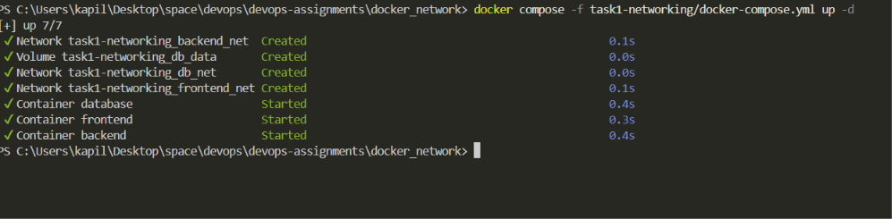
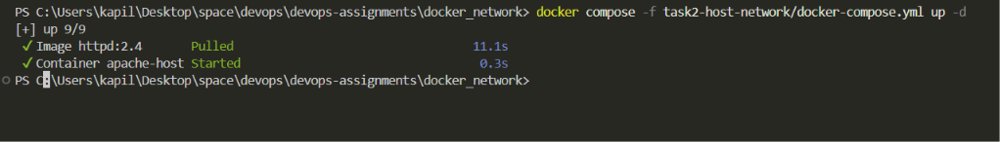
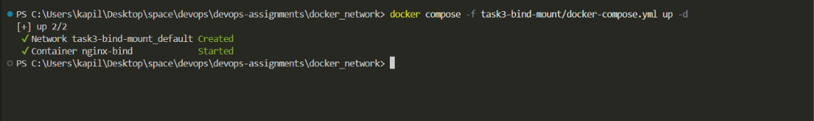
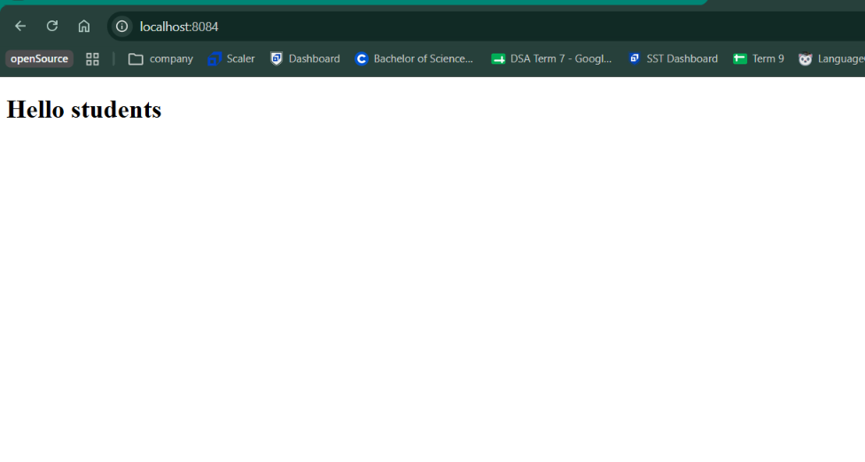

# Docker Networking & Volume - Homework Tasks

## Student Details

- **Name:** Kapil
- **Enrollment Number:** 24bcs10120

---

## Folder Structure

```
session8-docker-networking-volume/
├── task1-networking/
│   └── docker-compose.yml
├── task2-host-network/
│   └── docker-compose.yml
├── task3-bind-mount/
│   ├── index.html
│   └── docker-compose.yml
├── task4-overlay-network/
│   └── notes.md
└── README.md
```

---

## Task 1: Docker Container Networking

### Overview

- 3 containers: **frontend** (nginx), **backend** (alpine), **database** (mysql)
- 3 Docker bridge networks: `frontend_net`, `backend_net`, `db_net`
- Backend is connected to **2 networks** (frontend_net + backend_net)

### Network Topology

```
frontend  ──── frontend_net ──── backend
                                    │
                               backend_net
                                    │
database  ──────── db_net ──────────
```

### Commands

```bash
# Start all containers
cd task1-networking
docker compose up -d

# Check running containers
docker ps

# Check networks created
docker network ls

# Inspect a network
docker network inspect task1-networking_frontend_net

# Test connectivity: exec into backend and ping frontend
docker exec -it backend ping frontend

# Test connectivity: exec into backend and ping database
docker exec -it backend ping database

# Stop containers
docker compose down
```

### Screenshot



---

## Task 2: Host Network

### Overview

- Apache2 (`httpd:2.4`) container running with **host network mode**
- Container shares the host's network stack directly
- Apache accessible on port **80** without port mapping

### Commands

```bash
# Start Apache with host network
cd task2-host-network
docker compose up -d

# Verify container is running
docker ps

# Check network mode
docker inspect apache-host --format '{{.HostConfig.NetworkMode}}'

# Stop container
docker compose down
```

### Access

Open browser: `http://localhost:80`

> **Note:** Host network mode works natively on Linux. On Windows/Mac with Docker Desktop, use `http://localhost:80` — Docker Desktop handles the mapping.

### Screenshot



---

## Task 3: Bind Mount

### Overview

- Local folder `task3-bind-mount/` contains `index.html` with **"Hello students"**
- Nginx container bind mounts this file — any local change reflects instantly without restart

### Commands

```bash
# Start Nginx with bind mount
cd task3-bind-mount
docker compose up -d

# Verify container is running
docker ps

# Access the page
# Open browser: http://localhost:8084
```

### Verify Live Changes

1. Open `http://localhost:8082` — see **"Hello students"**
2. Edit `index.html` — change the content to anything
3. Refresh the browser — changes appear **without restarting** the container

```bash
# You can also verify from inside the container
docker exec -it nginx-bind cat /usr/share/nginx/html/index.html
```

### Stop

```bash
docker compose down
```

### Screenshot



---

## Task 4: Overlay Network

### Overview

Overlay networks enable containers on **different Docker hosts** to communicate as if on the same network. Used primarily with Docker Swarm.

### Key Points

| Feature    | Detail                       |
| ---------- | ---------------------------- |
| Driver     | `overlay`                    |
| Requires   | Docker Swarm mode            |
| Protocol   | VXLAN tunneling              |
| Scope      | Multi-host                   |
| Encryption | Optional (`--opt encrypted`) |

### Commands

```bash
# Initialize Swarm on manager node
docker swarm init

# Create overlay network
docker network create -d overlay my-overlay

# Deploy service on overlay network
docker service create --name web --network my-overlay nginx

# List all networks
docker network ls

# Inspect overlay network
docker network inspect my-overlay
```

### Use Cases

- Microservices spread across multiple servers
- Docker Swarm production deployments
- Encrypted service-to-service communication across hosts

> See `task4-overlay-network/notes.md` for full research notes.



---

## Resources

- [Docker Networking Docs](https://docs.docker.com/engine/network/drivers/)
- [Docker Overlay Networks](https://docs.docker.com/engine/network/drivers/overlay/)
- [Docker Bind Mounts](https://docs.docker.com/engine/storage/bind-mounts/)
- [Docker Host Network](https://docs.docker.com/engine/network/drivers/host/)
